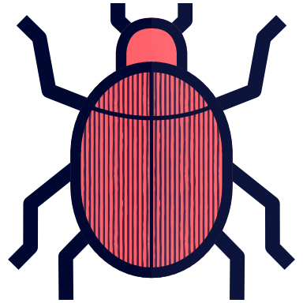

<!-- Header -->
<div align="center">

  
  <h1>Spruce Beetle</h1>
  
  <p>
    A toolkit for designing with timber offcuts in <a href="https://www.rhino3d.com">Rhino/Grasshopper.</a>
  </p>
  
<!-- Badges -->
<p>
  <a href="https://github.com/DominikReisach/Spruce-Beetle/commits/main">
    
  </a>
  <a href="https://github.com/DominikReisach/Spruce-Beetle/issues/">
    
  </a>
  <a href="https://github.com/DominikReisach/Spruce-Beetle/blob/master/LICENSE">
    
  </a>
</p>
   
<!-- Quick Links -->
<h4>
    <a href="">View Demo</a>
  <span> · </span>
    <a href="https://github.com/DominikReisach/Spruce-Beetle/issues/">Report Bug</a>
  </h4>
</div>

<br />

<!-- ToC -->
# :beetle: Contents

- [What?](#astonished-What?)
  * [Grasshopper Components](#cricket-grasshopper-components)  
  * [Demonstration](#dizzy_face-demonstration)
- [ToDo](#heavy_check_mark-ToDo)
- [License](#copyright-License)
- [Acknowledgements](#sparkles-Acknowledgements)
- [Citing](#v-Citing)
    <!--* [Upcycle Timber](#mortar_board-Upcycle-Timber)-->
    * [Spruce Beetle](#space_invader-Spruce-Beetle)

## :astonished: What?

### :cricket: Grasshopper Components


A description of each component and example files will follow soon. This toolkit is still <i>wip</i> and will be extended!

### :dizzy_face: Demonstration

## :heavy_check_mark: ToDo

- [ ] JSON serialization
- [ ] Add documentation
- [ ] Improve intersection joints
- [ ] Publish to Food4Rhino
- [ ] Find more bugs

## :copyright: License
Copyright &copy; 2022, Dominik Reisach

## :sparkles: Acknowledgements
This toolbox is being developed at the [Bauhaus-Universität Weimar](https://www.uni-weimar.de/en), Germany, in the scope of the master's thesis
<br><i>Upcycle Timber: A design-to-fabrication workflow for free-form timber structures with offcuts</i>.

The thesis was supervised by [Professor Dr. Jan Willmann](https://www.uni-weimar.de/en/art-and-design/chairs/theory-and-history-of-design/), [Professor Dr.-Ing. Sven Schneider](https://www.uni-weimar.de/de/architektur-und-urbanistik/professuren/infar), and [Professor Dr.-Ing. Stephan Schütz](https://www.uni-weimar.de/de/architektur-und-urbanistik/professuren/entwerfen-und-erproben/).

## :v: Citing 
<!-- ### :mortar_board: Upcycle Timber
```
``` -->

### :space_invader: Spruce Beetle
```
@software{spruce_beetle,
    title={Spruce Beetle},
    author={Dominik Reisach},
    year={2022},
    url={https://github.com/DominikReisach/Spruce-Beetle}
}
```
