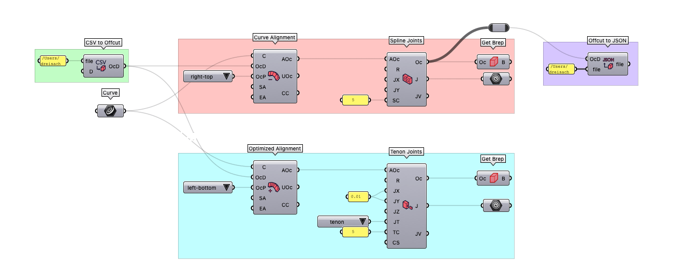
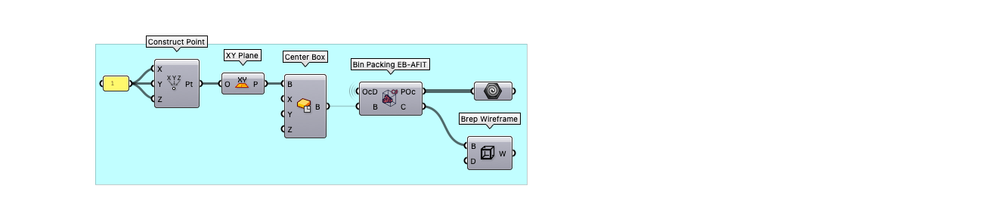
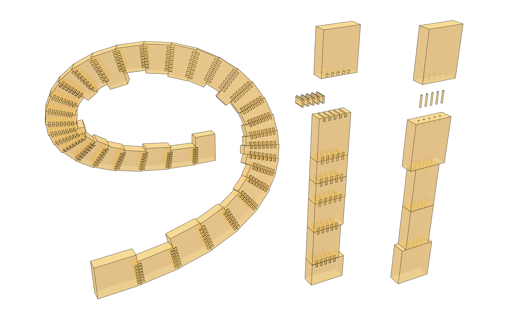
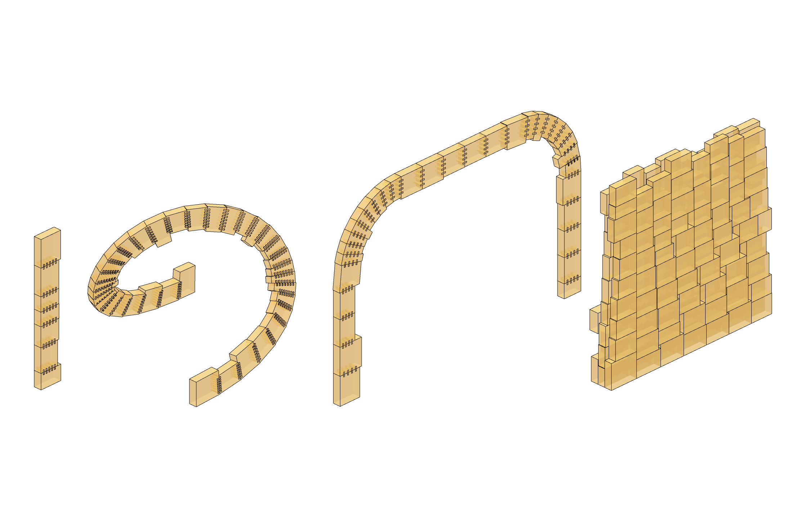

<!-- Header -->
<div align="center">

  
  <h1>Spruce Beetle</h1>
  
  <p>
    A toolkit for designing with timber offcuts in <a href="https://www.rhino3d.com">Rhino/Grasshopper.</a>
  </p>
  
<!-- Badges -->
<p>
  <a href="https://github.com/DominikReisach/Spruce-Beetle/commits/main">
    
  </a>
  <a href="https://github.com/DominikReisach/Spruce-Beetle/issues/">
    
  </a>
  <a href="https://github.com/DominikReisach/Spruce-Beetle/blob/master/LICENSE">
    
  </a>
  <a href="https://zenodo.org/badge/latestdoi/454536126">
    
  </a>
</p>
</div>

<br />

<!-- ToC -->
# :beetle: Contents

- [About](#astonished-about)
  * [Installation](#gear-installation)  
  * [Grasshopper Components](#cricket-grasshopper-components)  
  * [Examples and Documentation](#construction-examples-and-documentation)  
  * [Reproduce *Offcut Tales*](#recycle-reproduce-the-offcut-tales-demonstrator)
- [Acknowledgements](#sparkles-acknowledgements)
- [Citing](#v-citing)
    * [Conference Paper](#mortar_board-conference-paper)
    * [Plugin](#space_invader-plugin)

# :astonished: About

*SpruceBeetle* is a plugin designed for use within the [Rhino/Grasshopper](https://www.rhino3d.com) environment that facilitates reusing and repurposing waste timber, specifically timber offcuts. Provided with dimensional data about the material, this plugin streamlines the process of integrating the reclaimed material into curve-based designs,accommodating both linear or double-curved forms efficiently. Furthermore, it generates dry timber joints between components and simplifies the creation of fabrication data. Notably, *SpruceBeetle* is material agnostic, making it adaptable for use with various types of materials.

## :gear: Installation

Using *SpruceBeetle* requires you to have a [Rhino](https://www.rhino3d.com) 7 or 8 installation with a valid license. *SpruceBeetle* works on both Windows and MacOS.

To install *SpruceBeetle*, you can either

1. download the `SpruceBeetle.zip` folder under [latest release](https://github.com/dominikreisach/Spruce-Beetle/releases/), unpack it, and place the compiled `SpruceBeetle.gha` file and the `CromulentBisgetti.ContainerPacking.dll` file in your `Components Folder` for Grasshopper.

2. download it via Rhino's *Package Manager*.

## :cricket: Grasshopper Components
<div align="center">
  
</div>

## :construction: Examples and Documentation

The following documentation is created with the files located under [Documentation/Examples](https://github.com/dominikreisach/Spruce-Beetle/tree/main/Documentation/Examples), i.e., `sprucebeetle_examples.3dm` and `sprucebeetle_examples.gh`.

### Create Offcut Instances

<div align="center">
  
</div>

### Exemplary Workflow Alignment

<div align="center">
  
</div>

### Exemplary Workflow Bin-Packing

<div align="center">
  
</div>

### Example Designs

<div align="center">
  
</div>

<div align="center">
  
</div>

## :recycle: Reproduce the Offcut Tales Demonstrator

All files to reproduce the *Offcut Tales* demonstrator are located under [Documentation/Reproduce](https://github.com/dominikreisach/Spruce-Beetle/tree/main/Documentation/Reproduce). These files include:

1. A Rhino file with the geometric data: `offcut_tales.3dm`
2. A plattform-independent file containing the geometric data: `offcut_tales.obj`
3. A Grasshopper file with the script to produce the demonstrator: `offcut_tales.gh`
4. The numerical data of all offcuts that were available in this research project: `offcuts.csv`

In the files `offcut_tales.3dm` and `offcut_tales.obj`, you will find the geometric data of the demonstrator as it was fabricated. If you want to use the `offcut_tales.gh` file that produced it, you have to provide the correct link to the `offcuts.csv` file in the *Panel* component at the beginning of the script, see here:

<div align="center">
  
</div>

# :sparkles: Acknowledgements
This toolbox has been developed at the [Bauhaus-Universität Weimar](https://www.uni-weimar.de/en), Germany, in the scope of the master's thesis
<br><i>Upcycle Timber: A Design-to-Fabrication Workflow for Free-Form Timber Structures with Offcuts</i>.

The thesis was supervised by [Professor Dr. Sven Schneider](https://www.uni-weimar.de/de/architektur-und-urbanistik/professuren/infar), [Professor Dr. Jan Willmann](https://www.uni-weimar.de/en/art-and-design/chairs/theory-and-history-of-design/), and [Dr. Stephan Schütz](https://www.strukturstudio.de/).

# :v: Citing 
## :mortar_board: [Conference Paper](https://doi.org/10.1007/978-3-031-37189-9_24)
```
@incollection{reisachDesigntoFabricationWorkflowFreeForm2023,
  title = {A {Design-to-Fabrication Workflow} for {Free-Form Timber Structures Using Offcuts}},
  booktitle = {Computer-{Aided Architectural Design}. {INTERCONNECTIONS}: {Co-computing Beyond Boundaries}. {CAAD Futures 2023}},
  author = {Reisach, Dominik and Sch{\"u}tz, Stephan and Willmann, Jan and Schneider, Sven},
  editor = {Turrin, Michela and Andriotis, Charalampos and Rafiee, Azarakhsh},
  year = {2023},
  series = {Communications in {Computer} and {Information Science}},
  volume = {1819},
  pages = {361--375},
  publisher = {Springer},
  address = {Cham},
  doi = {10.1007/978-3-031-37189-9_24},
  isbn = {978-3-031-37189-9},
}
```

## :space_invader: [Plugin](https://doi.org/10.5281/zenodo.10071468)
```
@misc{spruce_beetle,
    title={Spruce Beetle},
    author={Dominik Reisach},
    year={2023},
    doi={10.5281/zenodo.10071468}
    url={https://github.com/DominikReisach/Spruce-Beetle}
}
```
